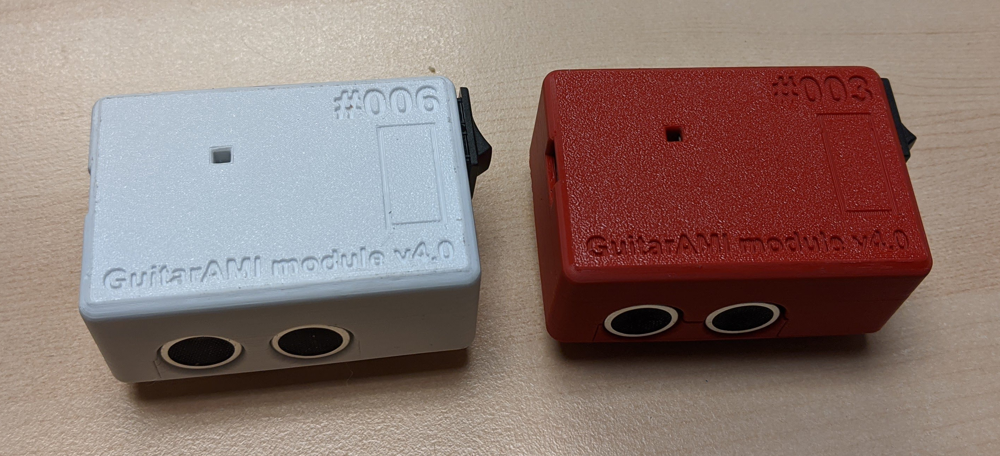

# GuitarAMI

The GuitarAMI is an Augmented Musical Instrument (AMI) using an acoustic guitar. The AMI is part of the [Puara](https://github.com/Puara) framework.

[GuitarAMI module - user guide](./docs/Module_user_guide.md)

## Building instructions

[GuitarAMI module](./docs/building_instructions_guitar_module.md)

## Description

Acoustic musical instruments, although very versatile, have intrinsic sonic limitations due to their construction characteristics. For the classical nylon strings guitar, these restrictions include short sustain and the lack of sound intensity control after the attack.

The GuitarAMI uses sensors installed non-invasively in classical guitars to generate data from gestures that control algorithms to overcome these limitations, providing new possibilities of expression for the performer.

### More Info on the instrument and the research

[https://www.edumeneses.com](https://www.edumeneses.com)

[http://www-new.idmil.org/project/guitarami/](http://www-new.idmil.org/project/guitarami/)

## Licensing

The code in this project is licensed under the MIT license, unless otherwise specified within the file.
