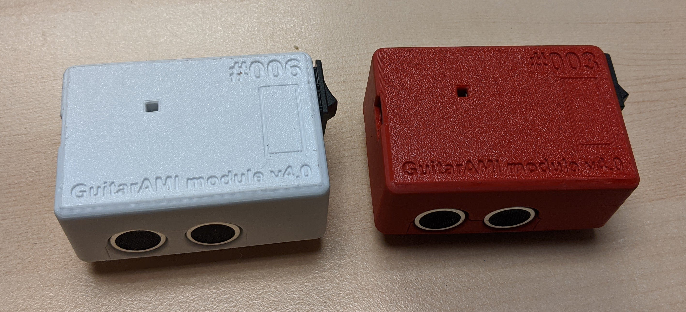

# GuitarAMI

The GuitarAMI is an Augmented Musical Instrument (AMI) using an acoustic guitar. The AMI is part of the [Puara](https://github.com/Puara) framework.

[GuitarAMI module - user guide](./docs/Module_user_guide.md)

## Building instructions

[GuitarAMI module](./docs/building_instructions_guitar_module.md)

## Description

Acoustic musical instruments, although very versatile, have intrinsic sonic limitations due to their construction characteristics. For the classical nylon strings guitar, these restrictions include short sustain and the lack of sound intensity control after the attack.

The GuitarAMI uses sensors installed non-invasively in classical guitars to generate data from gestures that control algorithms to overcome these limitations, providing new possibilities of expression for the performer.

### Hardware

The module is built around ESP32-based microcontrollers and supports two boards:

- **TinyPICO** — compact ESP32 board with a DotStar RGB LED for status indication
- **LOLIN D32 PRO** — Wemos ESP32 board with PWM-driven LED

Each module includes the following sensors:

| Sensor | Purpose |
|--------|---------|
| **IMU** (LSM9DS1 or BNO080) | 9-axis inertial measurement (accelerometer, gyroscope, magnetometer) plus quaternion and yaw/pitch/roll orientation |
| **Capacitive touch** | Detects touch interactions on the guitar body |
| **Ultrasonic distance** (e.g., RCWL-1601) | Measures hand-to-module distance |
| **Battery monitor** | Reads battery voltage and reports filtered percentage |

### Firmware

The firmware is an ESP32 PlatformIO project using the Arduino framework. It leverages the [Puara module library](https://github.com/Puara/puara-module) for WiFi connectivity, web-based configuration, and OSC communication, and the [Puara gestures library](https://github.com/Puara/puara-gestures) for high-level gesture extraction.

Key features:

- **Gesture recognition** — jab, shake, button press/hold/tap/double-tap/triple-tap derived from raw sensor data
- **OSC over WiFi (UDP)** — all sensor and gesture data are streamed as OSC bundles at ~100 Hz
- **Web configuration** — sensor settings, OSC target IP/port, and network credentials are configurable through a built-in web server
- **LED status indicators** — visual feedback for connection state and low battery
- **Battery monitoring** — voltage-to-percentage conversion with a moving-average filter

See the [firmware README](./firmware/README.md) for details on the OSC namespace and build instructions.

### 3D-Printed Enclosure

Printable enclosure designs (STEP and Fusion 360 files) are provided in the `3D_printed_enclosure/` directory, tailored for the TinyPICO + RCWL-1601 configuration with a battery bed.

### More Info on the instrument and the research

[https://www.edumeneses.com](https://www.edumeneses.com)

[http://www-new.idmil.org/project/guitarami/](http://www-new.idmil.org/project/guitarami/)

## Licensing

The code in this project is licensed under the MIT license, unless otherwise specified within the file.
