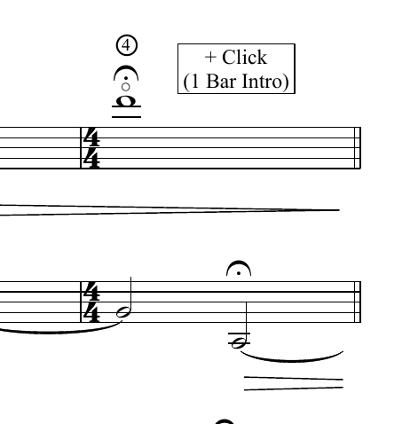
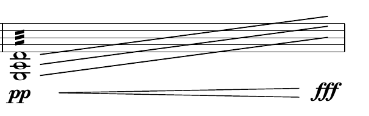
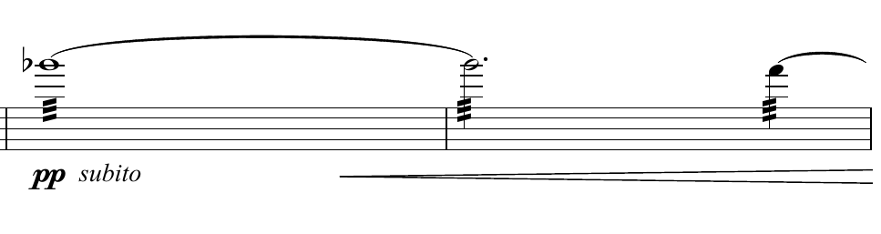
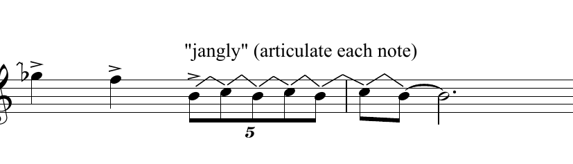

# GuitarAMI Music Creation Project

## Performance order

- [Focus (Harry Stafylakis): I-Radial Glare; II-Inward Gaze](#focus)
  - [Info](#info-focus)
  - [Mapping](#mappings-focus)
- [Insomnia Rain (Derek Cooper)](#insomnia-rain)
  - [Info](#info-insomnia)
  - [Mapping](#mappings-insomnia)
- [The Turing Test (Alex Burtzos)](#the-turing-test)
  - [Info](#info-turing)
  - [Mapping](#mappings-turing)
- [Extra: Trouveur](#extra-trouveur)

## Focus

<h3 id="info-focus">Info</h3>

Check `Inward Gaze (Stafylakis)- Focus - Mvt. II (Inward Gaze).wav`.

- Piece post-processed with electronics using [Reaper](https://www.reaper.fm/download.php)
- Use of distortion and delay effects
- The two movements are about 10 minutes long
- GuitarAMI as a bridge that provides control possibilities and nuance explotations using instrumental gestures

<h3 id="mappings-focus">Mapping</h3>

```asciiart
 Steve's GuitarAMI:
                                                     +---------------+
    +-------------+                                  | effects (Mod) |
    |  Audio IN   +--------------------------------->+               |
    +-------------+                                  |  distortion   +-----------+
                             +---------------+       |    reverb     |           |
 +----------------+          | SuperCollider +------>+     delay     |           |
 |  Foot switches +--------->+               |       |      etc      |           |
 +----------------+          |     Tracks    |       +---------------+           v
                             |       +       |                             +-----+-----+
+-----------------+          |  click track  +---------------------------->+ Audio OUT |
| module gestures +--------->+       +       |                             +-----------+
+-----------------+          |  OSC -> MIDI  |
                             +---------------+

Adam's GuitarAMI:
                                                     +---------------+
    +-------------+                                  | effects (Mod) |
    |  Audio IN   +--------------------------------->+               |
    +-------------+                                  |  distortion   +-----------+
                             +---------------+       |    reverb     |           |
 +----------------+          |               +------>+     delay     |           |
 |  Foot switches +--------->+               |       |      etc      |           |
 +----------------+          | SuperCollider |       +---------------+           v
                             |               |                             +-----+-----+
+-----------------+          |  OSC -> MIDI  +---------------------------->+ Audio OUT |
| module gestures +--------->+               |                             +-----------+
+-----------------+          |               |
                             +---------------+
```

Data mappings:

```verbatin
- Foot_Switch_1(Steve)        -> SuperCollider (start tracks)
- Foot_Switch_2(Steve)        -> SuperCollider (OSC->MIDI)        -> effects
- Foot_Switch_3(Steve)        -> SuperCollider (OSC->MIDI)        -> effects
- guitar_body_angle_Y(Steve)  -> effects (wet/dry reverb/delay)*
- guitar_body_angle_Y(Steve)  -> effects (distortion)*
- Foot_Switch_2(Adam)         -> SuperCollider (OSC->MIDI)        -> effects
- Foot_Switch_3(Adam)         -> SuperCollider (OSC->MIDI)        -> effects
- guitar_body_angle_Y(Adam)   -> effects (wet/dry reverb/delay)*
- guitar_body_angle_Y(Adam)   -> effects (distortion)*
- (...)
```

Visual Feedback:

- Steve:
  - track PLAY/PAUSE/STOP
  - clicktrack PLAY/PAUSE/STOP
  - Steve's effects ON/OFF
- Adam:
  - track PLAY/PAUSE/STOP
  - clicktrack PLAY/PAUSE/STOP
  - Adam's effects ON/OFF

> \* Need to check score for mappings marked (simultaneity)

### Insomnia Rain

<h3 id="info-insomnia">Info</h3>

- Pre-recorded electronics and Max/MSP
- Piece conceptually bound to a click track (no room for rhythmic improvisation)
- Check `Insomnia Rain Full.pdf`
- Room for playing with the amplitude of the rain and thunder and the placement of the electronics in the foreground/background of the musical texture
- Tied to score (low spare bandwidth)

<h3 id="mappings-insomnia">Mappings</h3>

```verbatin
+------------------------+     +----------------------------+     +---------------+
|GuitarAMI Module (Steve)|     |Sound Processing Unit(Steve)|     |   Computer    |
|    (gestural data)     +---->+      (gestural data)       +---->+               |
+------------------------+     +----------------------------+     |               |     +---------+
                                                                  |               +---->+Audio OUT|
+------------------------+     +----------------------------+     | Max/MSP patch |     +---------+
| GuitarAMI Module (Adam)+---->+Sound Processing Unit (Adam)+---->+               |
|    (gestural data)     |     |      (gestural data)       |     |               |
+------------------------+     +----------------------------+     +------+--------+
                                                                         ^
                                                                         |
                                                                     +---+----+
                                                                     |Audio IN|
                                                                     +--------+
```

Data mappings:

```verbatin
- Foot_Switch_1(Steve)        -> Max/MSP (previous trigger)
- Foot_Switch_2(Steve)        -> Max/MSP (next trigger)
- Foot_Switch_3(Steve)        -> Max/MSP (click track)
- guitar_body_angle_YPR(Adam) -> effects (wet/dry for the effect pool in 3 dimensions spread into 
                                          raindrops, distortion, delay, reverb, spatialization)
- guitar_distance(Adam)       -> effects (optional 2nd parameter)
- (...)
```

Visual Feedback:

- Steve:
  - electronic trigger number / measure number
- Adam:
  - electronic trigger number / measure number
  - dry/wet effects (energy)

### The Turing Test

<h3 id="info-turing">Info</h3>

- The Turing Test use Tape and click track
- The piece employs a live loop pedal effect that could be triggered through the footswitch
- Piece conceptually bound to a click track (no room for rhythmic improvisation)
Check `The Turing Test - Complete Score.pdf`
- The electronics in the Turing Test begin around 1 minute into the piece
- All of the electronics and guitar loops will be sequenced into one track by the composer

Example 1:



Example 2:



Example 3:



Example 4:



<h3 id="mappings-turing">Mappings</h3>

```verbatin
 Steve's GuitarAMI:
                                                      ┌───────────────┐
     ┌─────────────┐                                  │ effects (Mod) │
     │  Audio IN   ├─────────────────────────────────►│               │
     └─────────────┘                                  │    bypass     ├───────────┐
                              ┌───────────────┐       │               │           │
                              │ SuperCollider │       └───────────────┘           │
                              │               │                                   │
                              │               │                                   ▼
  ┌────────────────┐          │  Tape track   │                             ┌───────────┐
  │  Foot switches ├─────────►│      +        ├────────────────────────────►│ Audio OUT │
  └────────────────┘          │  Click track  │                             └───────────┘
                              │               │
                              └───────────────┘

 Adam's GuitarAMI:
                                                      ┌───────────────┐
     ┌─────────────┐                                  │ effects (Mod) │
     │  Audio IN   ├────┬────────────────────────────►│               │
     └─────────────┘    │                             │ gain control  ├───────────┐
                        │     ┌───────────────┐       │ pitch-shifter │           │
                        └────►│ SuperCollider ├──────►│    Freeze     │           │
  ┌────────────────┐          │               │       │  loop pedal   │           │
  │  Foot switches ├─────────►│               │       └───────────────┘           ▼
  └────────────────┘          │               │                             ┌───────────┐
                              │  Inf. reverb  ├────────────────────────────►│ Audio OUT │
 ┌─────────────────┐          │       +       │                             └───────────┘
 │ module gestures ├─────────►│  OSC -> MIDI  │
 └─────────────────┘          └───────────────┘
```

Data mappings:

```verbatin
- Foot_Switch_1(Steve)         -> SC (Play/pause)
- Foot_Switch_2(Steve)         -> SC (Mute/unmute Tape track)
- Foot_Switch_3(Steve)         -> SC ((Mute/unmute click track)
- Foot_Switch_1(Adam)          -> SC (Infinite Reverb ON/OFF) - Ex. 1
- Foot_Switch_2(Adam)          -> SC (OSC->MIDI) -> effect: gain ON/OFF
- Foot_Switch_3(Adam)          -> SC (OSC->MIDI) -> effect: pitch-shifter (ON/OFF)
- Tap(Adam)                    -> SC (OSC->MIDI) -> effect: Freeze (ON/OFF)
- guitar_body_angle_YPR(Adam)  -> SC (OSC->MIDI) -> effects: depth
- guitar_distance(Adam)        -> SC (OSC->MIDI) -> effect: gain control - Ex. 2
LOOP?
```

Visual Feedback:

- Steve:
  - track PLAY/PAUSE
  - Tape track mute
  - Click track mute
- Adam:
  - effects ON/OFF
  - moving ON/OFF

### Extra: Trouveur

>**Steve:**
>> If you look at the score, the top staff is the electronics throughout. It involves:
>>
>> - a delay patch with 8 different presets (specified in the score)
>> - a harmonizer that ranges from -2000 t0 +2000 cents
>>
>> The guitar part is EXTREMELY demanding, and as such, the piece is really designed as a duo between guitarist + electronics operator. I would essentially need to focus entirely on the guitar part, and have someone else follow along and trigger the appropriate presets in the electronics at the right times.
>>
>> It’s the kind of piece that if we fell a little bit out of sync – I don’t think it would matter – it would still sound cool.
>>
>> Where I think I can use the GuitarAMI and my own gestures, is the points in the score when it asks the electronics operator to “freely switch between particular delay presets”, or “freely slide >between different harmonizer ranges”
>>
>> I’m often doing aggressive percussive gestures with my hands, so it would have to be something different than this, and not TOO sensitive to movement, otherwise it would vary between the presets when I don’t want it to.
>>
>> I was thinking of keeping it simple:
>>
>> - rocking my torso/the guitar forward , or leaning back, when the score asks to change freely between the delay presets
>> - rocking my torso left/right (so guitar neck up, or down) when the score asks to change freely between the harmonizer ranges
>>
>> Or, vice versa. I think this would be very cool and could easily be integrated into my guitar performance. Still, it would demand a lot of you to follow along with the score and adjust things appropriately, as well as programming all this stuff beforehand.
>
>**Edu:**
>> This piece can really shine if we assume 2 performers but use another gestural controller for the second one. In that case, the guitarist can have some input on the harmonize using subtle guitar >movements, without consciously choosing a harmonize level, but converting the natural guitar movement into information mapped to the parameter. The operator can be promoted to a second performer, >and we can use the computer or another controller. I was thinking maybe the T-Stick, or some wrist-based controller, such as the M5StickC. Of course, the second performer also has to follow the >score (the T-Stick video is more like a demo/improvisation). The controller's advantages are possible mappings to interpolate the presets and more communication between guitarist and operator.
