# How to build: GuitarAMI guitar module

## BOM

| Qty | Description                                            | Online Reference                                                                            |
| --- |:-------------------------------------------------------|:------------------------------------------------------------------------------------------- |
| 1   | Rocker Switch                                          | https://www.digikey.ca/en/products/detail/bulgin/H8600VBACN/9598449                         |
| 1   | Small Suction Cups without Hooks                       | https://www.uline.ca/Product/Detail/S-17647/Store-Supplies/Suction-Cups-without-Hooks-Small |
| 1   | Perma-Proto Small Mint Tin Size Breadboard PCB         | https://www.adafruit.com/product/1214                                                       |
| 1   | Ultrasonic Distance Sensor - 3V compatible - RCWL-1601 | https://www.adafruit.com/product/4007                                                       |
| 1   | TinyPICO - ESP32 Development Board                     | https://www.adafruit.com/product/4335                                                       |
| 1   | 3.7V 2000mAh LiPo Rechargeable Battery                 | https://www.adafruit.com/product/2011                                                       |
| 1   | LSM9DS1 nine-axis Sensor Module 9-axis IMU             | https://www.sparkfun.com/products/13284                                                     |

## Instructions

Start with the Perma-Proto Breadboard and solder all required connections according to the picture.

The IMU uses I2C, and it will be connected on rows 11-14 (breadboard) pins.
The TinyPico I2C (SDA and SCL) connections will be soldered on rows 3 and 2 of the breadboard (opposite side).

The ultrasonic sensor trigger and echo will be connected on rows 9 and 8 on the breadboard.
The TinyPico pins for that will be connected on rows 4 and 5 on the breadboard (same side).

The remaining jumper wires are for VCC and ground.

> :warning: **The TinyPico cannot reliably provide 5V when powered from battery**: Make sure the chosen ultrasonic sensor operates with 3.3V!

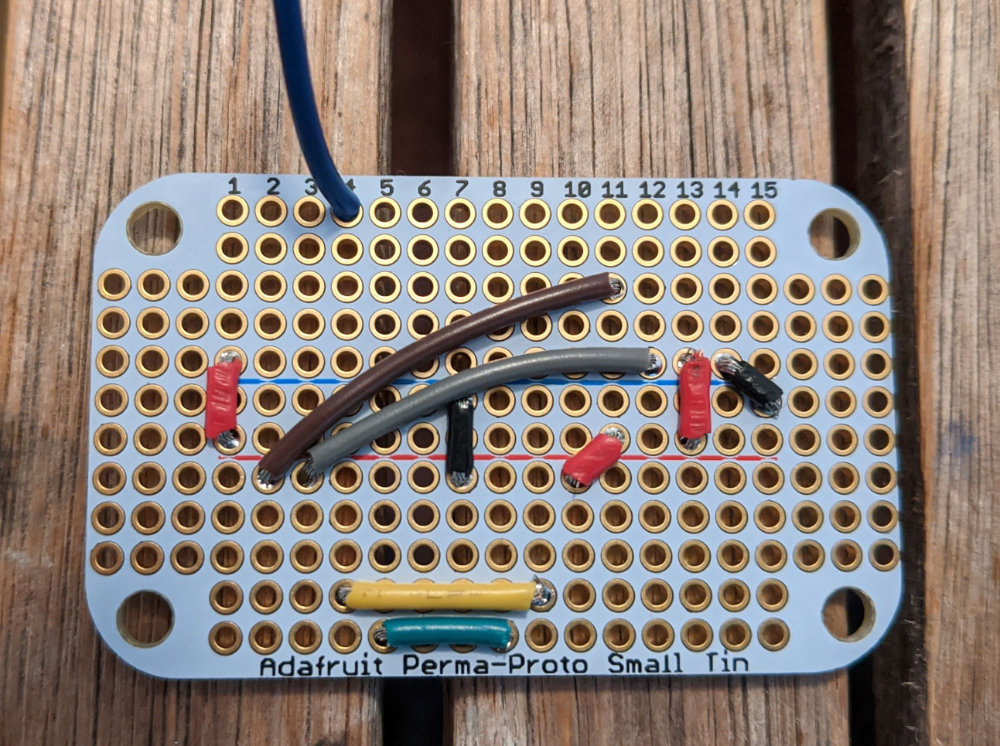

Proceed by soldering the IMU:

Then the ultrasonic sensor. Note that the sensor is soldered "upside down".

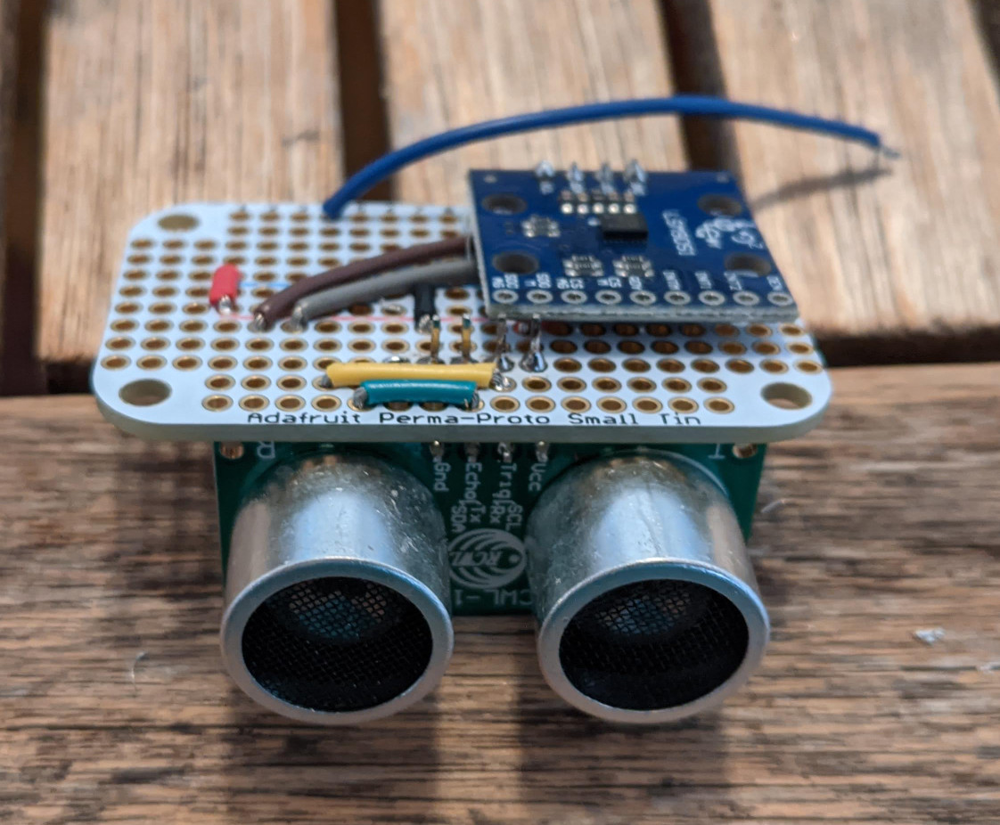

Start preparing the TinyPico: set the header pins according to the picture below:

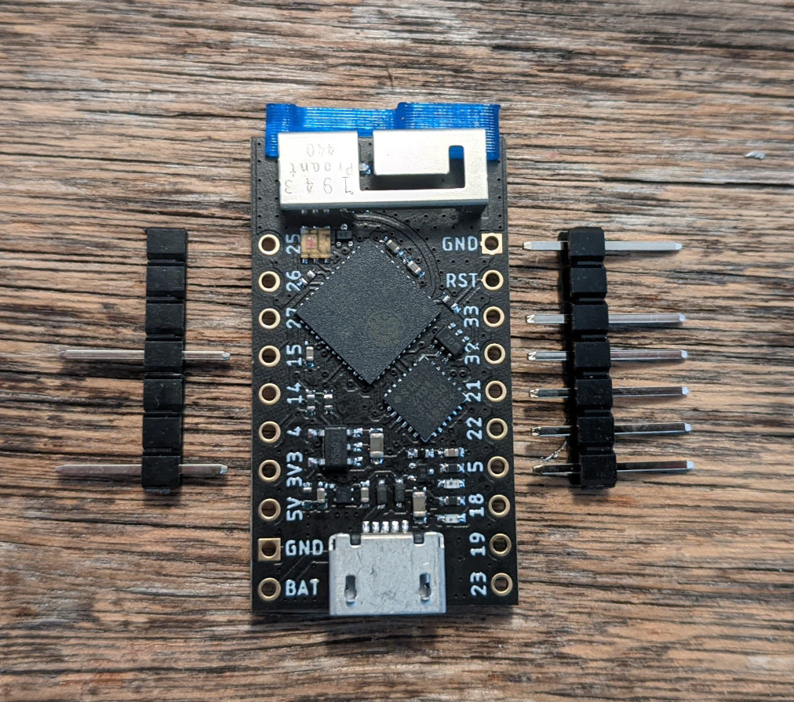

Solder the pins on the TinyPico...

... and the TinyPico to the breadboard according to the picture below.
Note that the USB connector must be aligned with the end of the breadboard.
That means some overlapping with the IMU is required.

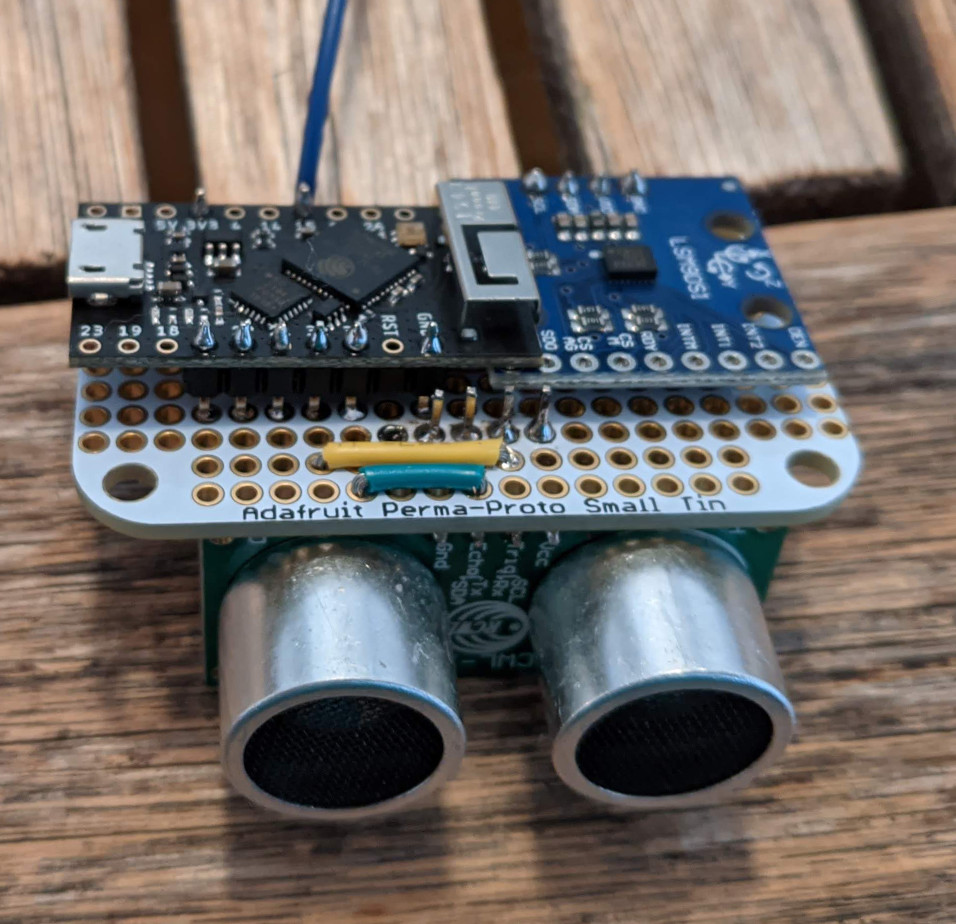

Start preparing the touch sensor: a piece of copper tape and some wiring:

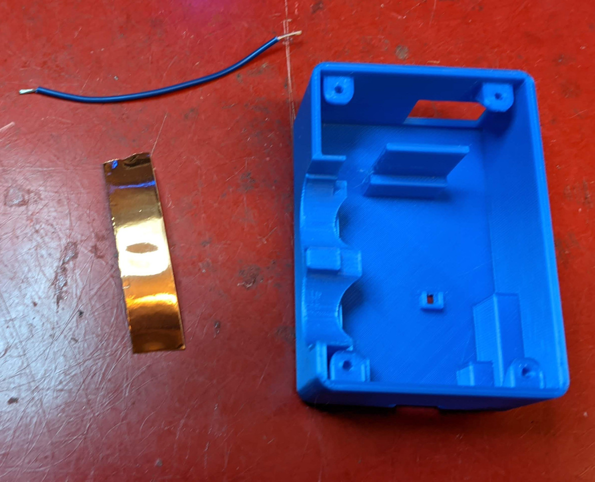

Tape and solder according to the picture:

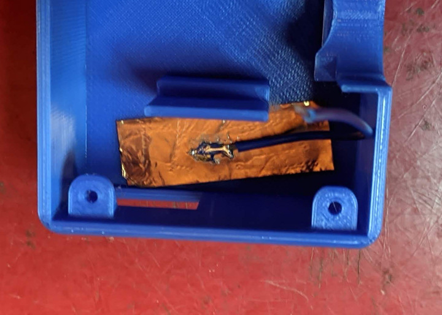

Protect the copper tape to prevent sensor acquisition problems:

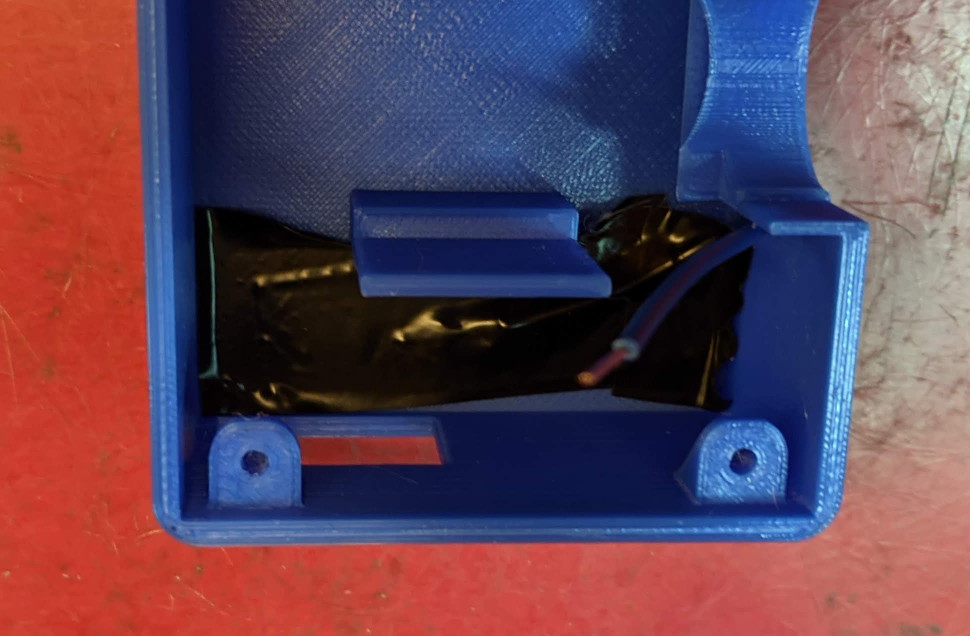

Lastly, prepare the rocker switch:

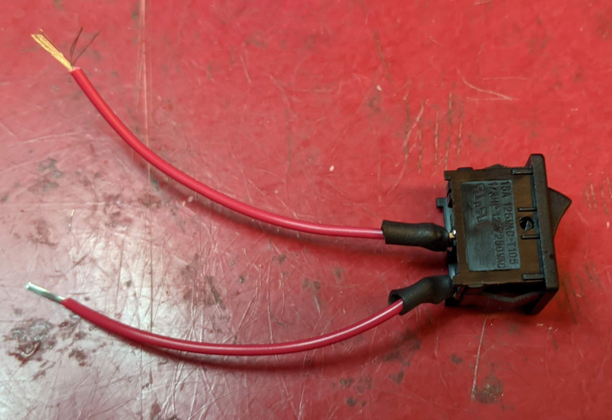

Add the 3D printed enclosure and assemble everything together according to the pictures below.
The battery caps protect the breadboard and battery, and it is recommended to use the bottom cap.
The top cap can be used to prevent the battery to shake inside the module, if needed.

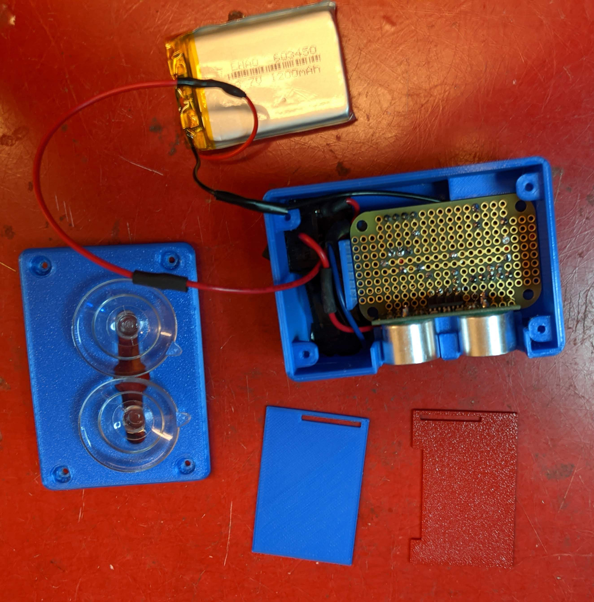

The top cap can be used to prevent the battery to shake inside the module, if needed.

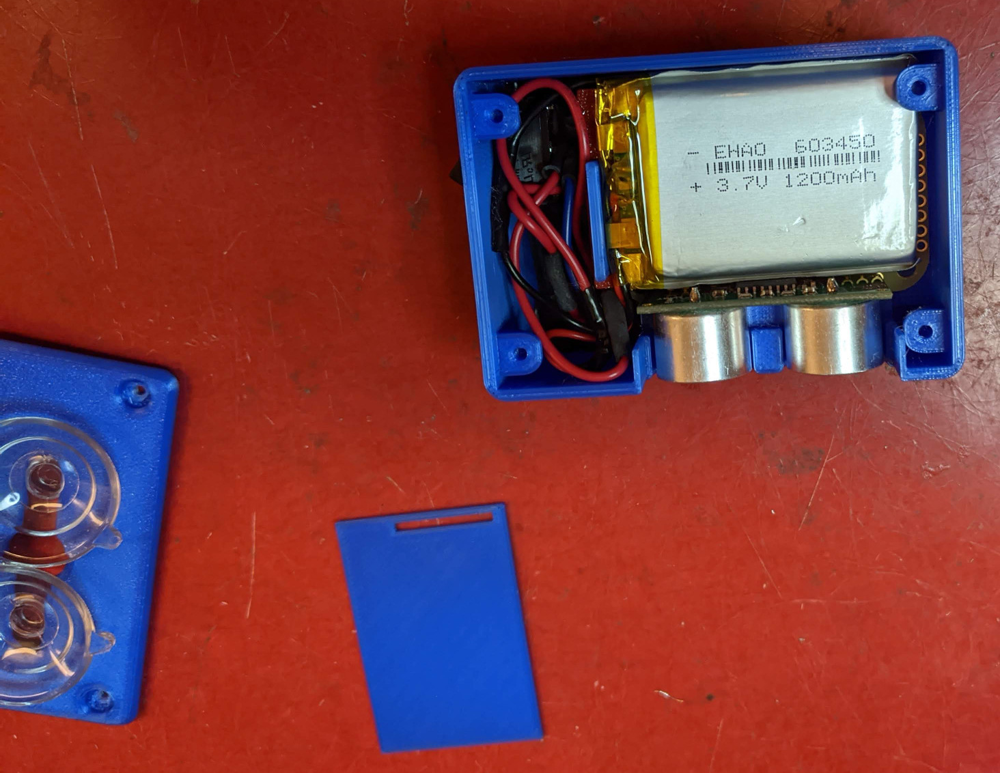

Done! Have fun.

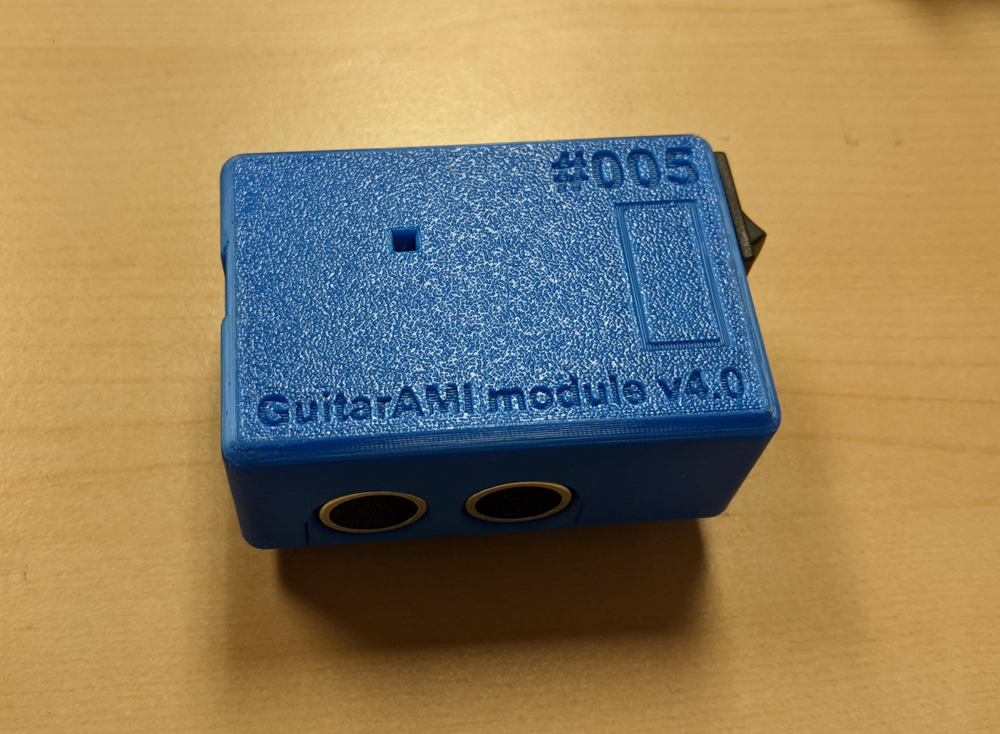
