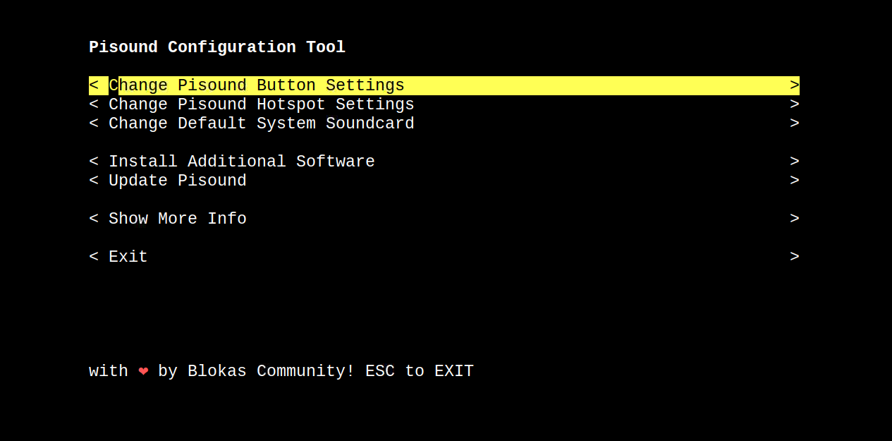

# JackTrip boxes - replication guide

- [JackTrip boxes - replication guide](#jacktrip-boxes---replication-guide)
  - [BOM](#bom)
  - [Hardware assembly](#hardware-assembly)
  - [Configuring Jack](#configuring-jack)
  - [Setting the server IP for JackTrip client boxes](#setting-the-server-ip-for-jacktrip-client-boxes)
  - [current mac addresses](#current-mac-addresses)

## BOM

To replicate the JackTrip boxes, you'll need:

- 1 Raspberry Pi 4 B 4GB with enclosure
- 1 SD card (min 8GB), and an SD card reader if needed
- 1 power supply compatible with the Raspberry Pi
- 1 audio interface
- 1 USB cable to connect the audio interface
- 1 power supply
- 1 ethernet cable

## Hardware assembly

- Follow the instructions available for the Raspberry Pi enclosure purchased. For the first 2 boxes, the enclosure instructions are available at [https://www.canakit.com/pi-case](https://www.canakit.com/pi-case)
- Flash the JackTrip box image (**jacktripbox.img.gz**) into the SD card using [ApplePiBaker](https://www.tweaking4all.com/hardware/raspberry-pi/applepi-baker-v2/), [balenaEtcher](https://www.balena.io/etcher/), or diskutil (dd).
- Put the SD card on the JackTrip box, connect the audio interface/cables according to the [user guide](jacktrip_box_user_guide.md), and turn the Raspberry Pi on. You can use a monitor, keyboard to control the JackTrip box during setup. It is also possible to connect to the JackTrip box using *ssh*.
- Enter PiSound configuration: `sudo pisound-config`
  - Change Pisound HotSpot settings:
    - ssid: `jacktrip00X` (use SPU's ID)

(image source: [PiSound documentation](https://blokas.io/pisound/docs/pisound-config/))

- Enter Raspi-Config: `sudo raspi-config`
  - System options:
    - Hostname: `jacktrip00X` (use chosen ID)

(image source: [Raspberry Pi documentation](https://www.raspberrypi.com/documentation/computers/configuration.html#raspi-config))

## Configuring Jack

If the user wants to replace the audio interface or try different settings, we can run the `patchbox` command and change the Jack audio configuration.

The recommended configuration for the Scarlett Solo is *Sr=48000, bs=128, period=3*. More agressive configurations can be tested in faster networks, as the Scarlett Solo can use *Sr=96000, bs=128, period=2* locally without any issues.

## Setting the server IP for JackTrip client boxes

- Edit the *jacktrip_client.service* file: `nano ~/.config/systemd/user/jacktrip_client.service`
- Replace the IP at the line `ExecStart=/home/patch/sources/jacktrip/builddir/jacktrip -c 132.204.140.247 --clientname jacktrip_client` for the new IP address
- Save the file (Ctrl+O, then hit ENTER in *nano*) and exit (Ctrl+X in *nano*).
- Update the systemctl daemon: `systemctl --user daemon-reload`
- Restart the service: `systemctl --user restart jacktrip_client.service`
- To check connection (if the server is availalbe and accessible through the given IP): `systemctl --user status jacktrip_client.service`

## current mac addresses

- JackTrip001
  - ethernet: e4:5f:01:65:ae:dd
  - wireless: e4:5f:01:65:ae:de
- JackTrip002
  - ethernet: e4:5f:01:5d:4a:ae
  - wireless: e4:5f:01:5d:4a:af