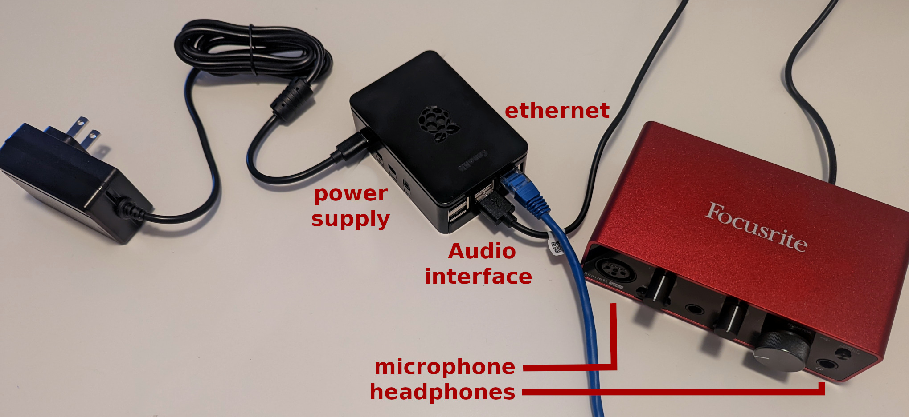
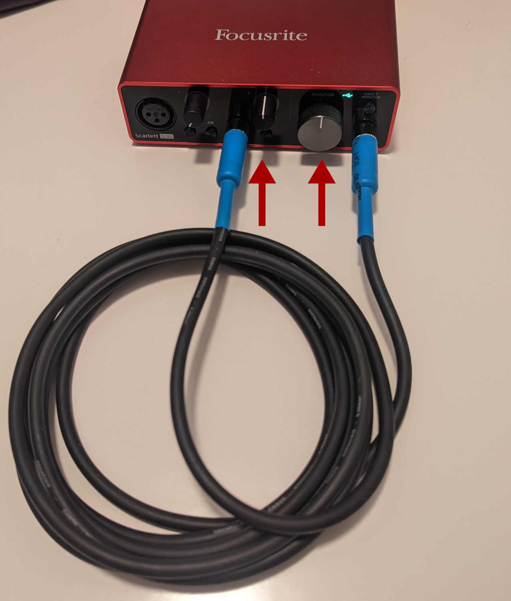

# JackTrip box - user guide

## Regular use: connect to JackTrip server

To use the **JackTrip box client** at home and connect to the UdeM JackTrip server, you will need the following:

- 1 Raspberry Pi Jacktrip client
- 1 audio interface
- 1 USB-A to USB-c cable
- 1 power supply
- 1 ethernet cable
- microphone, active speakers, and headphones

Follow the connections showered in the picture below:

Connect the ethernet cable to your router and turn the JackTrip box ON (connect to the power outlet).

After a few seconds, you should be automatically connected to the UdeM JackTrip server.

## Latency test

If you're required to assist in a latency test, connect an audio cable between the instrument input and the headphone jack, as shown in the picture below:

Make sure both the imput gain and the monitor volume are set to the "12 o'clock" position (check the red arrows on the image).

An operator at the JackTrip server will launch the latency test and collect the results.
