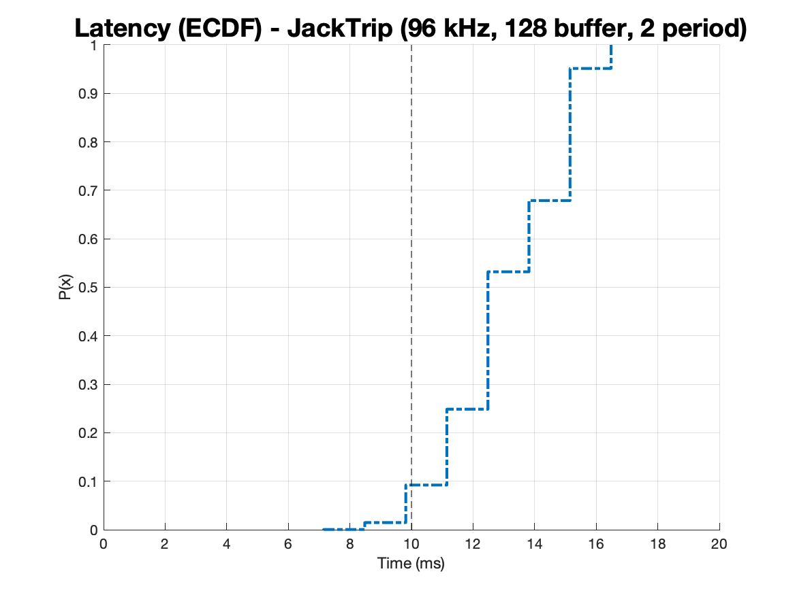

# JackTrip tests - Brams/IDMIL/uToronto journal

Report in progress used on the JackTrip tests and hardware assembly using the GuitarAMI SPU hardware for the SingWell partnership.

## Schedule

- [X] [First project meeting](#october-14th-2021).
- [X] Duplicate the existing setup (SPU + JackTrip) and automatically set one as a client and another as a server (Oct. 18-22nd, 2021).
- [X] [Latency tests](#october-28th-2021) between the 2 SPUs in a local network on Brams (Oct. 28th, 2021).
- [X] [Latency measurements](#local-network-latency-results) between the 2 SPUs in a local network using jack-delay (Nov. 2nd to 4th, 2021).
- [ ] Test internet latency between the 2 SPUs. One SPU will be located at Brams and another at IDMIL. We will need IT on both universities to fully open UDP communication at port 4464, and we'll probably need to set a VPN between both institutions (TBD, probably Nov. 5th, 2021).
- [ ] Define audio interface for the SingWell SPUs (TBD).
- [ ] Build 2 SPUs for the project (TBD).
- [ ] Mailing one of the SPUs to uToronto and final tests (TBD).

## October 14th, 2021

Meeting summary:

- We successfully ran JackTrip on the GuitarAMI Sound Processing Unit (SPU). The SPU acted as a server, and we could connect a laptop also running JackTrip and a client.
- The SPU is capable of serving JackTrip, synthesize sounds, or share audio through the network.
- Start discussing next week the strategies to communicate between UdeM and McGill.

## October 28th, 2021

- Preliminary tests on Brams using two [GuitarAMI SPUs](https://github.com/edumeneses/GuitarAMI/blob/jacktrip/docs/SPU_user_guide.md). Setup worked using a local network, the SPUs, and a laptop used to interact with the machines.

## Local network latency results

- Loopback latency using the built-in interface [Pisound](https://blokas.io/pisound/):
  - Jack configuration: 48000Hz (sample rate), 128 samples (buffer size), 2 period
    - Average latency SPU003: 8.921 ms
    - Average latency SPU005: 8.924 ms

- Latency bettween 2 SPUs (local network) using the built-in interface [Pisound](https://blokas.io/pisound/):
  - Test 1 - Jack configuration: 48000Hz (sample rate), 128 samples (buffer size), 2 period
    - Average latency: 30.256 ms
  - Test 2 - Jack configuration: 96000Hz (sample rate), 128 samples (buffer size), 2 period
    - Average latency: 13.125 ms
    - ECDF: 

- Latency bettween 2 SPUs (local network) using the [Presonus AudioBox USB](https://www.presonus.com/products/audiobox-usb) for 48 kHz and [Motu Ultra Lite  mk4](https://motu.com/en-us/news/introducing-the-ultralite-mk4/) for 96 kHz on the client end:
  - Test 3 - Jack configuration: 48000Hz (sample rate), 128 samples (buffer size), 2 period
    - Average latency: 29.645 ms
  - Test 4 - Jack configuration: 96000Hz (sample rate), 128 samples (buffer size), 2 period
    - Average latency: 17.617 ms

Results Summary:

| Description             | Sample rate | Average latency |
| ----------------------- | ----------- | --------------- |
| Loopback                | 48 kHz      | 8.923 ms        |
| JackTrip with Pisound   | 48 kHz      | 30.256 ms       |
| JackTrip with Pisound   | 96 kHz      | 13.125 ms       |
| JackTrip with USB audio | 48 kHz      | 29.645 ms       |
| JackTrip with USB audio | 96 kHz      | 17.617 ms       |
